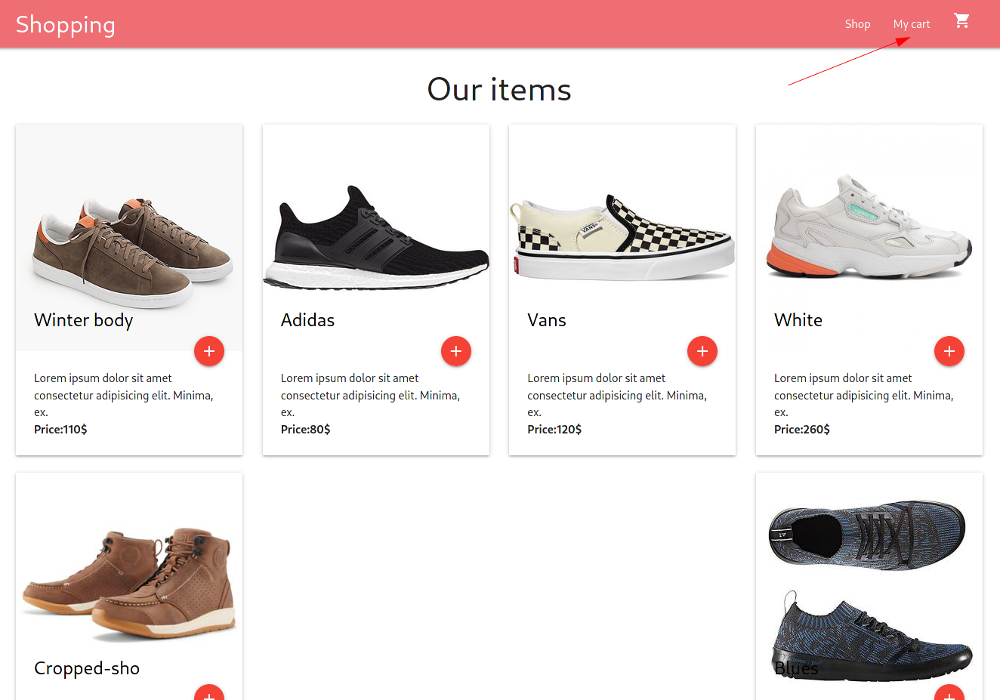
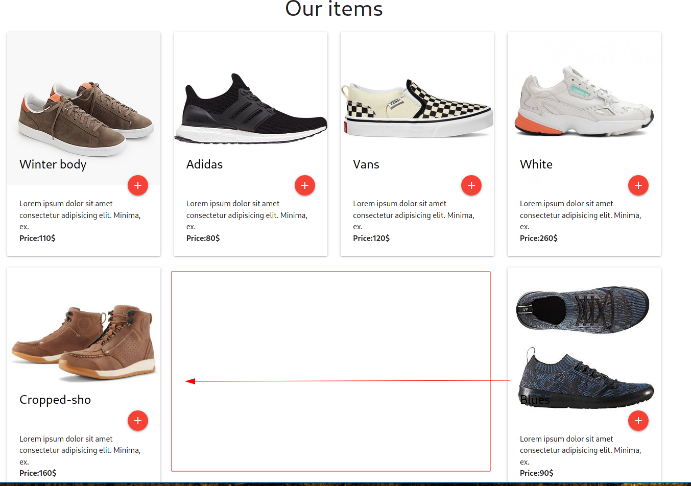

# Frontend coding challenge

This is a basic e-commerce cart application built with React & Redux & Materialize Css

This simple application prototype is the base application for the coding challenge.

Currently, implemented features:

### Features
* Home page with the list of products
* Add items to the cart

## Your objective for the challenge:

### New features to be implemented
Implement the "My Cart" page:

with the following functions:
* Remove items from the cart
* Edit the quantity of the items in real time
* Calculate automatically the total including the shipping

Bonus feature: implement the counter for the cart icon, indicating the number of items in the cart.

### Bugs to fix
There is a bug on the home page that is placing the last item on the right side of the screen:

Pleas provide a fix to the issue, so that the items are followed one after another.

## Your solution:
Please provide the result as a gitlab repository.

### What we look for
- The project structure
- Frontend applications UI/UX
- Coding style, best practices and tests

# Getting started
### Requirements

* Node.js
* NPM

### Package installation
```bash
npm install
```
 ### Start the React App
 Execute the following command: 
```bash
npm start
```
The application will start automatically in your browser on http://localhost:3000
